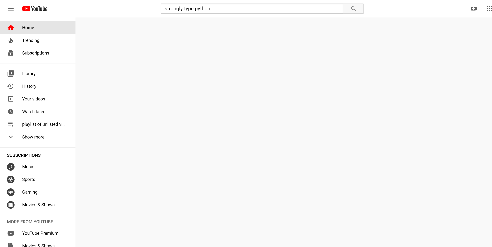
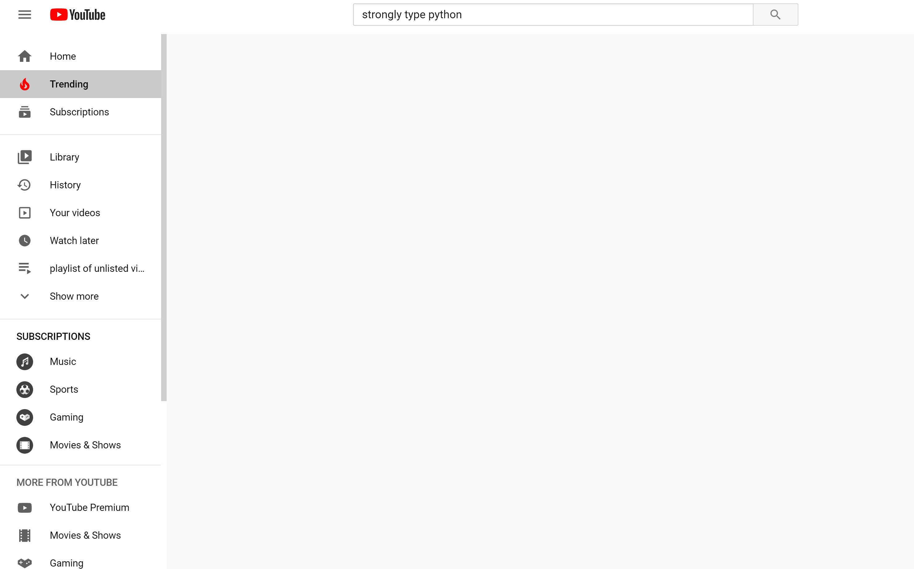
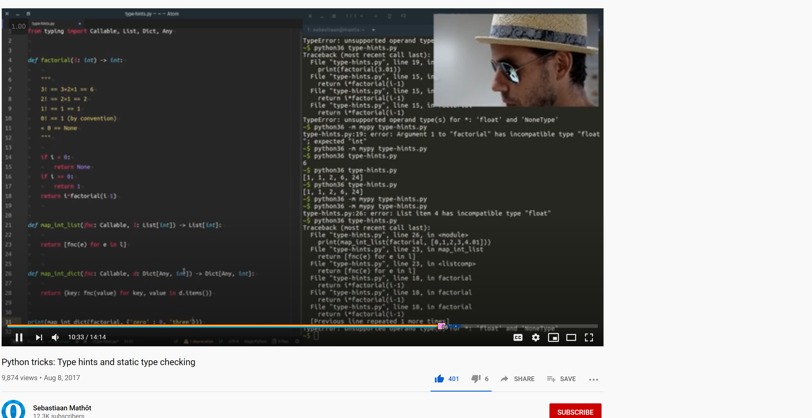

## Installation

1. Install [Stylish for Chrome](https://chrome.google.com/webstore/detail/stylish-custom-themes-for/fjnbnpbmkenffdnngjfgmeleoegfcffe?hl=en) or [Stylish for Firefox](https://addons.mozilla.org/en-US/firefox/addon/stylish/)

2. Copy the code from the file, if using firefox use the firefox variant of the code.

3. Create a new style in stylish

4. Paste the CSS onto the editor in stylish

5. On the URL option, select apply to URLs on the domain and input 'youtube.com' 

6. Save the stlye (CTRL + S) and refresh YouTube

## Demo

**Home page hidden**
---

Now you won't fall under YouTube's trap of luring you to a blackhole of mind-numbing content.

Just focus on the search and you'll see that you will be more precise on the videos you watch and why you're on YouTube

**Trending page hidden**
---

Just in case you accidentally hit trending, hiding the trending page will let you stay calm about being bombarded with Movie Trailers and Music Videos.

Leaving your [ATP](https://www.ncbi.nlm.nih.gov/pmc/articles/PMC3257700/) to be reserved for academic videos only 😎

**Video recommendations hidden**
---

Ever clicked on a video that's gonna successfully impact your career? Only to be lured in by the YouTube algorithm by super cute 1 hour looped cat videos?

No? Just me? Well no worries! Now you don't have to worry about that anymore 😁

**Video comments hidden**
---

Don't even think about scrolling down, all those shots of dopamine curated by people and ranked by YouTube will no longer 

steal your precious brain power!
